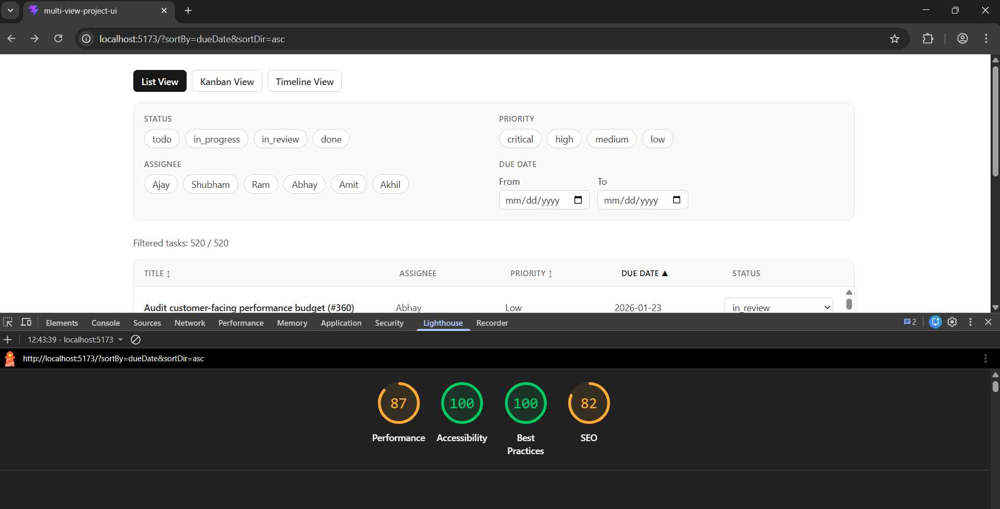

# Multi-View Project Tracker UI

A frontend project-management interface built with React + TypeScript, featuring shared-data multi-view rendering, custom drag-and-drop, virtual scrolling, URL-synced filters, and simulated live collaboration indicators.

## Tech Stack

- React 19 + TypeScript
- Vite
- Zustand (state management)
- Tailwind CSS

## Setup Instructions

1. Install dependencies:

```bash
npm install
```

2. Start development server:

```bash
npm run dev
```

3. Build production bundle:

```bash
npm run build
```

4. Preview production build:

```bash
npm run preview
```

## State Management Decision (Why Zustand)

I used **Zustand** to keep one shared source of truth for tasks, filters, and list sorting across List, Kanban, and Timeline views. This project needs cross-view state updates (e.g., drag status changes in Kanban, inline status edits in List, filter and URL sync across all views) without prop drilling.

Zustand keeps this clean with minimal boilerplate and selector-based subscriptions, reducing unnecessary re-renders in large lists (500+ tasks). Compared with Context + `useReducer`, it simplifies action organization while still preserving predictable immutable updates.

## Virtual Scrolling Implementation

Virtual scrolling in List view is implemented from scratch (no `react-window` / `react-virtualized`).

Approach:
- Fixed row height + scroll container.
- Compute `startIndex` and `endIndex` from `scrollTop` and viewport height.
- Render only visible rows plus a **buffer of 5 rows above and below**.
- Preserve scrollbar correctness with a full-height spacer (`rowCount * rowHeight`).
- Position rendered rows absolutely at `top = index * rowHeight`.

This keeps DOM size small and scroll smooth while handling large datasets.

## Custom Drag-and-Drop Approach

Kanban drag-and-drop is implemented with native **Pointer Events** (mouse + touch), with no drag-and-drop library.

Core behavior:
- On drag start, capture card geometry and pointer offset.
- Keep layout stable by inserting a same-height **placeholder** at source position.
- Render a floating drag preview that follows pointer position (opacity + shadow).
- Detect drop zones via `elementFromPoint` + column markers.
- Highlight valid drop columns.
- On valid drop: commit status update to store.
- On invalid drop: animate snap-back and clear drag state.

## Lighthouse Screenshot

Desktop Lighthouse report (Performance target: **85+**):



> If your screenshot file path differs, update the image path above accordingly.

## Explanation 

The hardest UI problem in this project was custom Kanban drag-and-drop with stable layout behavior across mouse and touch interactions. A naive implementation removes the dragged card from normal flow, which causes visible layout shift and makes users lose context in dense columns. To solve this, I measured the source card dimensions at drag start and rendered a same-height placeholder at the exact source index, while moving a floating preview card with pointer coordinates. This preserved column structure and prevented jumpy reflow during drag.

Another challenge was combining precise drop feedback with low complexity. I used pointer hit-testing (`elementFromPoint`) to identify active drop zones and apply subtle highlight states in real time. Valid drops commit status changes directly to the shared store; invalid drops trigger a short snap-back transition before drag state cleanup.

With more time, I would refactor drag logic into a dedicated hook with an explicit state machine (idle, dragging, hovering, dropping, reverting). That would reduce coupling between rendering and interaction logic, improve testability for edge cases (especially pointer cancel/touch transitions), and make behavior easier to extend for advanced features like cross-column reordering.
